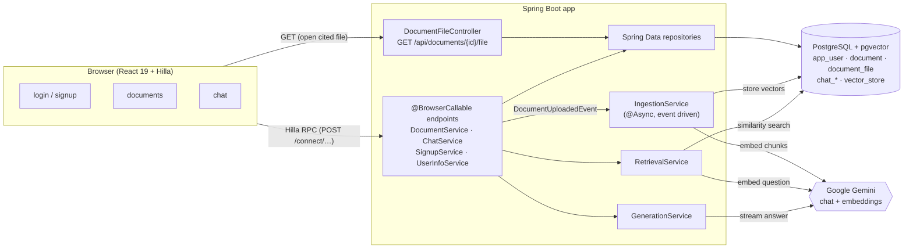
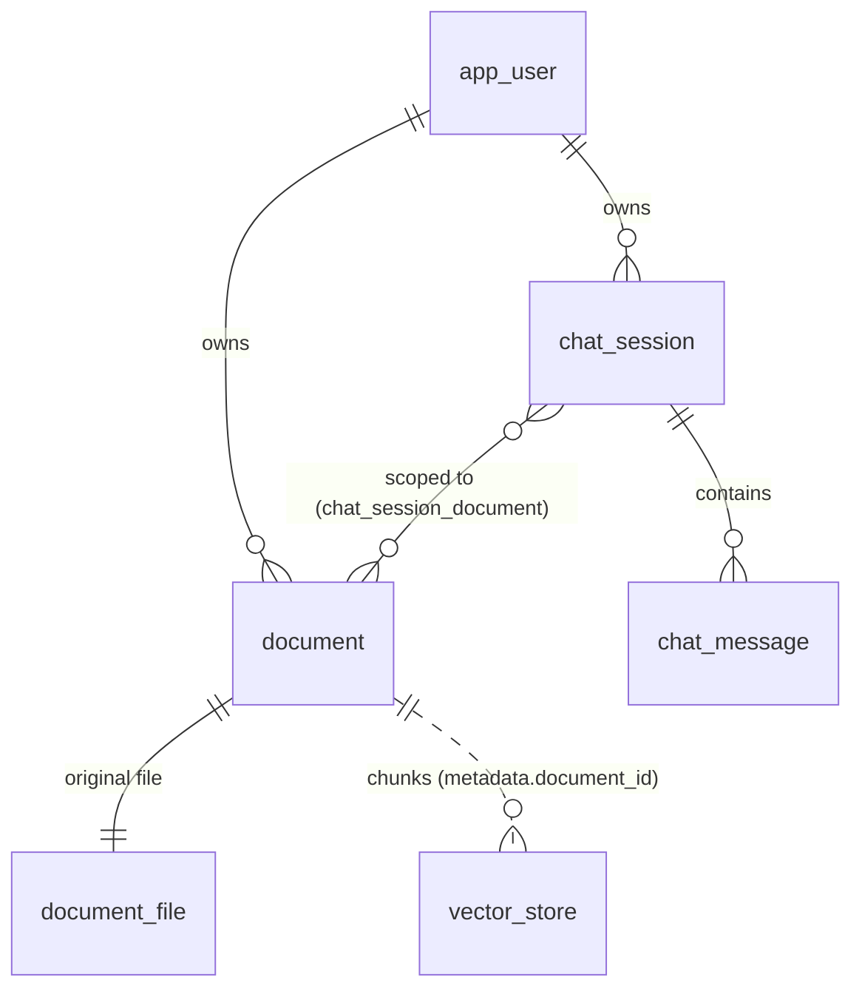
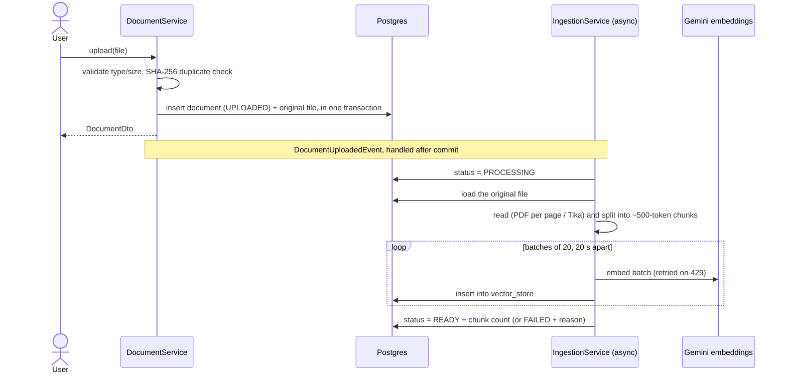
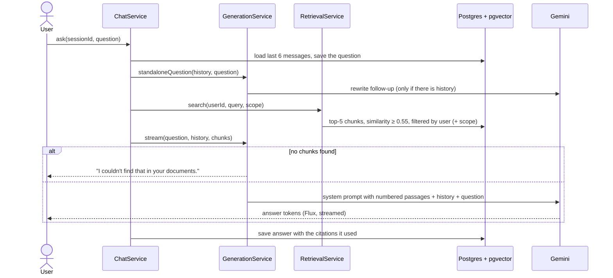

# Chat with my docs

Upload your own documents, then chat with an AI that answers **only from them** and shows where each answer came from.

This is a proof of concept for **Retrieval-Augmented Generation (RAG)** built with Spring Boot and Spring AI. Each user
has a private library of documents. Questions are answered by Google Gemini using only the passages retrieved from
that library, and every answer includes clickable source citations that open the file at the cited page.

## Features

- **Accounts:** sign up, log in, log out. Every user sees only their own documents and chats.
- **Document library:** upload PDF, DOCX, TXT and MD files (up to 20 MB). Files are indexed in the background, and a
  status badge moves through *Queued → Processing → Ready* (or *Failed*, with the reason and a **Reprocess** button).
  Duplicate uploads are detected by SHA-256 checksum.
- **Grounded chat:** answers stream in word by word and cite sources as `[1]`, `[2]`, …. If the documents don't
  contain the answer, the reply is *"I couldn't find that in your documents."*
- **Citations:** hover a source chip to see the passage; click it to open the original file (PDFs open at the cited page).
- **Follow-up questions:** "and for interns?" is rewritten into a standalone question before searching, and recent
  history is sent with each question.
- **Chat scope:** a chat can use all of your documents or only the ones you pick.
- **Chat history:** chats are saved, auto-titled from the first question, and can be renamed or deleted.
- **Stop button:** cancel an answer mid-stream; the partial answer is kept with a *Stopped* note.
- **Free-tier friendly:** embeddings are batched and throttled, and rate-limit errors are retried and shown as
  readable messages.

## Tech stack

| Layer | Technology |
|---|---|
| Language | Java 21 (virtual threads), TypeScript |
| Backend | Spring Boot 4.1, Spring AI 2.0 |
| Frontend | React 19 through Vaadin 25 / Hilla (file-based routes, type-safe generated endpoint clients) |
| LLM | Google Gemini: `gemini-3.8-flash` (chat), `gemini-embedding-001` (768-dim embeddings) |
| Database | PostgreSQL 17 with the pgvector extension (HNSW index, cosine distance) |
| Migrations | Flyway |
| Containers | Docker Compose (`pgvector/pgvector:pg17`), Testcontainers for tests |
| Document parsing | Spring AI PDF reader (page by page), Apache Tika (DOCX, TXT, MD) |
| Build | Maven (wrapper included); the Vaadin plugin downloads Node.js and builds the frontend |

## Spring and Spring Boot technologies used

| Technology | Used for |
|---|---|
| **Spring Boot starters** | `data-jpa`, `security`, `validation`, `flyway`, `vaadin`, `hilla` |
| **Spring Boot Docker Compose** (`spring-boot-docker-compose`) | Starts the pgvector container from `compose.yaml` on `spring-boot:run` and wires the datasource via a service-connection label; no manual DB setup |
| **Spring Data JPA / Hibernate** | Entities and repositories for users, documents, chat sessions and messages (`ddl-auto=validate`, Flyway owns the schema) |
| **Spring Security** | Form login, BCrypt password hashing, `UserDetailsService` backed by the `app_user` table, `@PermitAll` / `@AnonymousAllowed` on endpoints, `/api/**` requires login |
| **Spring AI `ChatClient`** | Streaming chat completions and the follow-up question rewrite, with prompt templates (`.st` files) |
| **Spring AI `VectorStore` (PgVectorStore)** | Storing embeddings with metadata, similarity search with a top-k, a threshold and metadata filter expressions |
| **Spring AI document readers + `TokenTextSplitter`** | Reading PDFs/DOCX/TXT/MD and splitting them into ~500-token chunks |
| **Spring AI Google GenAI starters** | Auto-configured Gemini chat and embedding models |
| **Spring application events** | `DocumentUploadedEvent` + `@TransactionalEventListener`: ingestion starts only after the upload transaction commits |
| **`@Async` + virtual threads** | Background ingestion (`spring.threads.virtual.enabled=true`) |
| **Spring Framework core retry (`org.springframework.core.retry.RetryTemplate`)** | Retrying embedding batches that hit Gemini's rate limit (30 s → 60 s → 120 s) |
| **`@ConfigurationProperties`** | Typed `app.*` settings (`AppProperties`), overridable by environment variables |
| **Spring transactions** | `@Transactional` services, plus `TransactionTemplate` so no transaction stays open while an answer streams |
| **Project Reactor (`Flux`)** | Streaming Gemini's tokens to the browser through a Hilla endpoint |
| **Spring MVC `@RestController`** | Plain GET endpoint for serving uploaded files (Hilla endpoints are POST-only) |
| **Flyway Java migration as a Spring bean** | `V8` copies files from the old upload folder into `document_file` once |
| **Spring Boot Testcontainers** | Integration tests against a real pgvector database |
| **Spring Boot DevTools** | Hot reload in development |

## Architecture

The backend is packaged by layer. Hilla generates TypeScript clients for every `@BrowserCallable` service, so the
React views call Java methods directly with full type safety.



The three RAG stages are kept in separate services, and `GenerationService` is the only class that calls the chat model:

| Stage | Class | Responsibility |
|---|---|---|
| Ingestion | `IngestionService`, `DocumentReaderFactory`, `EmbeddingThrottler` | Read → split → attach metadata → embed in throttled batches → store in `vector_store` |
| Retrieval | `RetrievalService` | Similarity search, **always filtered by the caller's user id** (and optionally by the chat's document scope) |
| Generation | `GenerationService`, `PromptBuilder` | Rewrite follow-ups, build the numbered context, stream Gemini's answer, keep only the citations actually used |

`ChatService` orchestrates a question end to end, and `DocumentService` handles uploads, deletes and reprocessing.

### Data model



- `document` holds file metadata, status (`UPLOADED`, `PROCESSING`, `READY`, `FAILED`), chunk count and error message.
- `document_file` holds the original uploaded file (`bytea`), in its own table so listing documents never loads file
  contents. It is deleted together with its document (`ON DELETE CASCADE`). Keeping files in the database means the
  app needs no persistent disk.
- `vector_store` holds each chunk's text, a 768-dim embedding and JSON metadata (`document_id`, `user_id`,
  `file_name`, `page`, `chunk_index`). It is created by Flyway (`V4`), and Spring AI only validates it.
- `chat_message.citations` is JSONB, so saved answers keep their source chips.

## Flow

### 1. Upload and ingestion



The documents page polls the list, so the badge updates on its own. Documents interrupted by a restart are marked
`FAILED` on the next start and can be reprocessed.

### 2. Asking a question



If the user presses **Stop** or Gemini fails, the partial answer is saved with a note, so the chat history stays consistent.

## API structure

The UI talks to the backend mainly through **Hilla browser-callable services**. They are Spring beans exposed as
`POST /connect/{Service}/{method}` with JSON bodies, and TypeScript clients are generated into
`src/main/frontend/generated/`. All of them require a logged-in user except `SignupService`.

### `DocumentService`

| Method | Returns | Description |
|---|---|---|
| `list()` | `DocumentDto[]` | The user's documents, newest first |
| `upload(file)` | `DocumentDto` | Multipart upload; validates type, size and duplicates, then queues ingestion |
| `delete(id)` | `void` | Deletes the row, its vector chunks and the file |
| `reprocess(id)` | `DocumentDto` | Re-runs ingestion for a `FAILED` document |

### `ChatService`

| Method | Returns | Description |
|---|---|---|
| `listSessions()` | `ChatSessionDto[]` | The user's chats, most recently used first |
| `createSession(documentIds)` | `ChatSessionDto` | New chat; an empty list means "all documents" |
| `getSession(sessionId)` | `ChatSessionDto` | One chat |
| `renameSession(sessionId, title)` | `ChatSessionDto` | Rename (1–200 characters) |
| `deleteSession(sessionId)` | `void` | Deletes the chat and its messages |
| `getMessages(sessionId)` | `ChatMessageDto[]` | Messages in order, with citations |
| `ask(sessionId, question)` | `Flux<string>` | Runs RAG and streams the answer token by token |

### `SignupService` (anonymous) and `UserInfoService`

| Method | Returns | Description |
|---|---|---|
| `SignupService.register(username, displayName, password)` | `void` | Creates an account |
| `UserInfoService.getUserInfo()` | `UserInfo` | Username, display name and roles of the logged-in user |

### REST and auth endpoints

| Endpoint | Description |
|---|---|
| `GET /api/documents/{id}/file` | Streams the original file inline (PDFs can be opened at `#page=N`). Returns 404 for other users' files |
| `POST /login`, `POST /logout` | Spring Security form login and logout (handled by the Vaadin security configurer) |

### DTOs

| DTO | Fields |
|---|---|
| `DocumentDto` | id, fileName, contentType, sizeBytes, status, chunkCount, errorMessage, createdAt |
| `ChatSessionDto` | id, title, updatedAt, scoped, documentIds |
| `ChatMessageDto` | id, role (`USER`/`ASSISTANT`), content, createdAt, citations |
| `Citation` | index (`[n]`), documentId, fileName, page, snippet |
| `UserInfo` | username, displayName, roles |

Errors are thrown as Hilla `EndpointException`s (for example `UploadRejectedException`, `DocumentNotFoundException`,
`AiServiceException`), so the UI shows their messages directly. Gemini quota errors become readable text instead of
raw API errors.

## Security and data isolation

- Passwords are hashed with BCrypt, and every route except login and sign-up requires authentication.
- Every repository lookup is by `id` **and** `owner_id`, so another user's document or chat looks like it doesn't exist.
- Vector search always includes a `user_id` metadata filter in `RetrievalService`, so a question can never retrieve
  another user's chunks, whatever the chat scope.
- The Gemini API key is read from the environment (or `.env`) on the server only. It is never sent to the browser.

## Prerequisites

- JDK 21
- Docker Desktop (running)
- A Gemini API key from [Google AI Studio](https://aistudio.google.com/). The free tier is enough for a demo.
  Google may use free-tier content to improve its products, so only upload non-confidential documents.

Node.js is not needed: the Vaadin Maven plugin downloads it.

## Setup

1. Create a `.env` file in the project root (it's git-ignored):

   ```properties
   GEMINI_API_KEY=your-key-here
   ```

   A normal `GEMINI_API_KEY` environment variable works too.

2. That's it. Spring Boot starts the PostgreSQL container from `compose.yaml` automatically, and Flyway creates the tables.

## Run

```bash
./mvnw spring-boot:run
```

Open <http://localhost:8080> and either **create an account** (*Create an account* on the login page) or log in with a
demo user (created only in the `dev` profile, which is the default):

| User | Password |
|---|---|
| `demo` | `demo` |
| `alice` | `alice` |

The first start takes a few minutes while the frontend is built. Uploaded files are stored in PostgreSQL, not on the
local disk.

## Test

```bash
./mvnw test      # unit + integration tests (Testcontainers), no Gemini calls
./mvnw verify    # the same, plus the production build
```

Tests use fake chat and embedding models, so they work offline and use no API quota. Tests that call the real Gemini API are tagged `external` and skipped by default:

```bash
./mvnw test -Dtest='GeminiSmokeTests,VectorStoreSmokeTests' -Dexternal=true
```

## Demo script

1. Log in as `demo`.
2. **Documents** → upload a PDF with a few pages of distinct facts (for example an HR policy). The badge goes *Queued → Processing → Ready* and shows the chunk count.
3. **New chat** (the start screen) → leave the document picker on *All documents*, or pick some.
4. Ask *"How many days of annual leave do interns get?"*. A typing indicator shows while the documents are searched,
   then the answer types out and ends with a source chip like `1 hr-policies.pdf · p.1`.
5. Hover the chip to see the passage; click it to open the PDF at that page.
6. Ask a follow-up: *"and for full-time employees?"*. It's understood from the conversation.
7. Ask something off-topic: *"What is the capital of France?"* → *"I couldn't find that in your documents."*
8. Log in as `alice` in another browser: she sees none of demo's documents or chats.
9. Back as `demo`, **Documents** → delete the PDF. Its file and all its chunks are removed.

## Configuration

Set in `src/main/resources/application.properties` (or override with environment variables, e.g. `APP_RAG_TOP_K=8`):

| Property | Default | Meaning |
|---|---|---|
| `app.max-upload-size` | `20MB` | Largest accepted file |
| `app.ingestion.chunk-size` | `500` | Target chunk size in tokens |
| `app.ingestion.batch-size` | `20` | Chunks embedded per Gemini request |
| `app.ingestion.pause-between-batches` | `20s` | Pause between batches (free-tier token limit) |
| `app.rag.top-k` | `5` | Chunks retrieved per question |
| `app.rag.similarity-threshold` | `0.55` | Minimum cosine similarity (measured: relevant ≈ 0.62–0.71, off-topic ≤ 0.47) |
| `app.rag.history-messages` | `6` | Earlier chat messages sent with each question |
| `app.rag.max-question-length` | `2000` | Longest accepted question, in characters |

The chat model runs at temperature `0.2`. The embedding size is fixed at 768 because the `vector_store.embedding`
column is `vector(768)`; changing it needs a new migration and re-ingesting all documents.

Each answer logs its latency and token usage, e.g. `Answer: 3614 ms total, first text after 900 ms | tokens: prompt=1450, completion=64, total=1514`.

## Project layout

```
src/main/java/com/company/chatdocs/
  config/      SecurityConfig, AiConfig, AsyncConfig, AppProperties
  entity/      JPA entities (AppUser, Document, ChatSession, ChatMessage, …)
  repository/  Spring Data repositories
  service/     IngestionService, RetrievalService, GenerationService, ChatService, DocumentService, …
  dto/         Records sent to the browser
  controller/  File download (GET /api/documents/{id}/file)
  migration/   Flyway Java migration V8 (moves files from the old upload folder into the database)
  exception/, event/, seed/
src/main/frontend/
  views/       File-based routes: login, signup, documents, chat/, chat/{sessionId}
  components/  ChatMessages, Composer, CitationChips, DocumentScopePicker, …
src/main/resources/db/migration/   Flyway SQL migrations (V1–V7)
src/main/resources/prompts/        Prompt templates (rag-system.st, rewrite-question.st)
compose.yaml                       pgvector container used in development
```

## Limitations

- Scanned PDFs without a text layer can't be indexed (there is no OCR).
- Ingestion runs inside the app process, so there is no external job queue. Interrupted jobs are marked failed on restart.
- Original files are stored in PostgreSQL (`bytea`). That's simple and survives restarts on hosts without a disk, but
  it counts against the database size; a large library would be better in object storage.
- Gemini's free tier limits throughput: large documents take a while to embed, because batches are paused to stay under the token limit.

## Troubleshooting

- **"Gemini's free-tier quota is used up"**: the free tier allows roughly 1,000 embedding requests per day and limited chat requests per minute. Wait a minute (or until the next day) and use **Reprocess** on failed documents.
- **`gemini-2.5-flash` returns 404**: it's closed to new API keys; this project uses `gemini-3.8-flash`.
- **A document is stuck or failed**: failed documents show the reason and a **Reprocess** button. Documents interrupted by a restart are marked failed on the next start.
- **curl in Git Bash and Hilla uploads**: run with `MSYS_NO_PATHCONV=1`, otherwise the multipart field name `/file` is rewritten into a Windows path.
